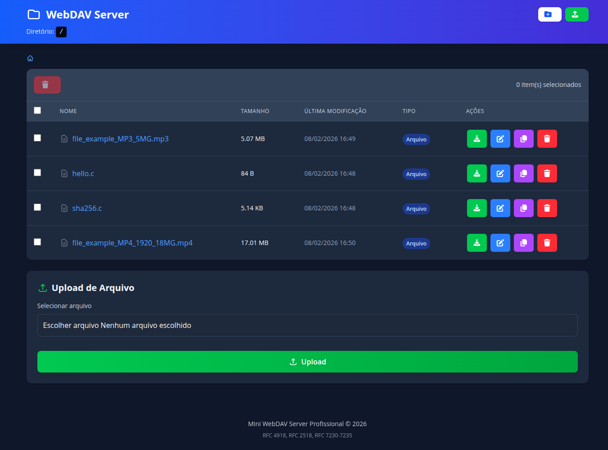

# WebDAV Server

Servidor WebDAV em C++ com foco em portabilidade, compilado com Zig Build e Cosmopolitan.

## Recursos

- Servidor HTTP/WebDAV com operações comuns (`GET`, `PUT`, `DELETE`, `MKCOL`, `PROPFIND`, `MOVE`, `COPY`, `LOCK`, `UNLOCK`)
- Interface de listagem de diretórios no navegador
- Autenticação Basic opcional
- Limite de taxa por IP
- Build nativo e matriz de cross-compilation via `build.zig`

## Requisitos

- Zig 0.15.2
- Cosmocc 4.0.2

Download usado neste projeto:

- `https://ziglang.org/download/0.15.2/zig-x86_64-linux-0.15.2.tar.xz`
- `https://cosmo.zip/pub/cosmocc/cosmocc-4.0.2.zip`

## Build

Build nativo:

```bash
zig build native -Doptimize=ReleaseFast
```

Build da matriz completa de targets:

```bash
zig build matrix -Doptimize=ReleaseFast
```

Os binários são gerados em `release/bin`.

## Uso

```bash
./release/bin/webdav -r . -p 8080
```

Opções disponíveis:

- `-r <root>` diretório raiz (padrão: `.`)
- `-p <porta>` porta do servidor (padrão: `8080`)
- `-u <usuario>` usuário para Basic Auth
- `-w <senha>` senha para Basic Auth
- `-t <segundos>` timeout de conexão (padrão: `30`)
- `-m <max_req>` máximo de requisições por minuto por IP (padrão: `1000`)
- `-v` modo verboso
- `-h` ajuda

Exemplo com autenticação:

```bash
./release/bin/webdav -r /srv/webdav -p 8080 -u admin -w senhaforte -v
```

## GitHub Actions

O workflow em `.github/workflows/release.yml`:

- baixa e instala Zig 0.15.2 diretamente da URL oficial
- baixa e instala `cosmocc` 4.0.2
- executa `zig build matrix` (inclui o build do `webdav_x86_64-unknown-cosmo.com` via `build.zig`)
- compacta cada binário individualmente em `.tar.gz` com nome por triple/target (ex.: `webdav_x86_64-linux-musl.tar.gz`)
- publica todos os `.tar.gz` no artifact do workflow
- quando houver evento de release (`published`), publica todos os `.tar.gz` como assets da Release

## Interface


